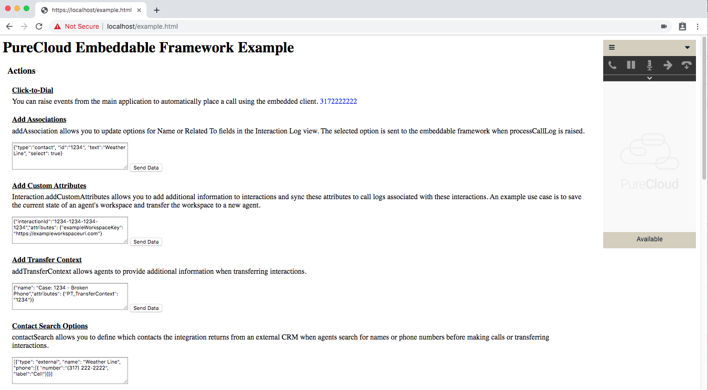

# PureCloud Embeddable Framework Example

This repository contains a basic setup for a PureCloud Embeddable Framework example page that you can use to explore the PureCloud Embeddable Framework APIs in real-time.

Note:
- This repo has been [forked from here](git@github.com:utilitywarehouse/purecloud-embeddable-framework-example.git)
- [integration video](https://www.youtube.com/watch?v=-GmhCsu0fbg)

# Table of Contents

- [PureCloud Embeddable Framework Example](#purecloud-embeddable-framework-example)
- [Table of Contents](#table-of-contents)
- [Getting Started](#getting-started)
  - [TL;DR](#tldr)
  - [Prerequisites](#prerequisites)
  - [Installation](#installation)
  - [Configuration](#configuration)
  - [Usage](#usage)
- [Additional Information](#additional-information)

# Getting Started

## TL;DR

1. Clone the repository.
2. Run `npm install`.
3. Edit the **example.html** and **framework.js** files.
4. Run a local server.
5. Open the **example.html** file in your browser.

You can now interact with the PureCloud Embeddable Framework APIs in real-time.

## Prerequisites

 * Git installed on your computer.
 * Node.js (with npm) installed on your computer.
 * PureCloud credentials.
 * A PureCloud OAuth client with the **Token Implicit Grant (Browser)** grant type selected. 
   For more information, see [Create an OAuth client (Resource Center)](https://help.mypurecloud.com/?p=188023).

## Installation

1. Clone the repository.
2. Run `npm install` in a command-line application.

## Configuration

1. Edit the **example.html** file. This file is included in the cloned repository. 
   **Note**: If your PureCloud organization is located in North America (mypurecloud.com), you do not need to update the example.html file. 
   a. Open the file in a text editor. 
   b. Update the iframe URL to point to the correct region for your PureCloud organization. 
   For more information about the iframe URL, see [iframe URLs (Developer Center)](https://developer.mypurecloud.com/api/embeddable-framework/deployments/iframe-urls.html). For a list of regions, see [Change the region of your PureCloud organization (Resource Center)](https://help.mypurecloud.com/?p=167012). 
   c.  Save your changes.
2. Edit the **framework.js** file. This file is included in the cloned repository.  
   a. Open the file in a text editor.  
   b. Under `clientIds`, add **Client ID** to the region where your PureCloud organization is located. Client ID is found in the OAuth client that you created in PureCloud.  
   For more information about `clientIds`, see [clientIds (Developer Center)](https://developer.mypurecloud.com/api/embeddable-framework/configMethods/clientIds.html). For more information about the OAuth client, see [Prerequisites](#prerequisites). 
   c. Save your changes.

## Usage

1. Run a local server.
   * Windows 
      a. Run **Command Prompt** as an administrator. 
      b. Type `cd {name of your PureCloud Embeddable Framework project}`. 
      c. Type `node server.js`.
   * macOS 
      a. Open a **Terminal** window. 
      b. Type `cd {name of your PureCloud Embeddable Framework project}`. 
      c. Type `sudo node server.js`.
2. In your browser, go to https://localhost/example.html.
3. Log in to the client.

You can now interact with the example page and explore the PureCloud Embeddable Framework APIs in real-time. For example, to see how click-to-dial works, click the click-to-dial link on the example page.

# Additional Information

This content is [licensed](/LICENSE) under the MIT license.

For more information about PureCloud Embeddable Framework, see [PureCloud Embeddable Framework overview (Developer Center)](https://developer.mypurecloud.com/api/embeddable-framework/) and [About PureCloud Embeddable Framework (Resource Center)](https://help.mypurecloud.com/?p=196909).
